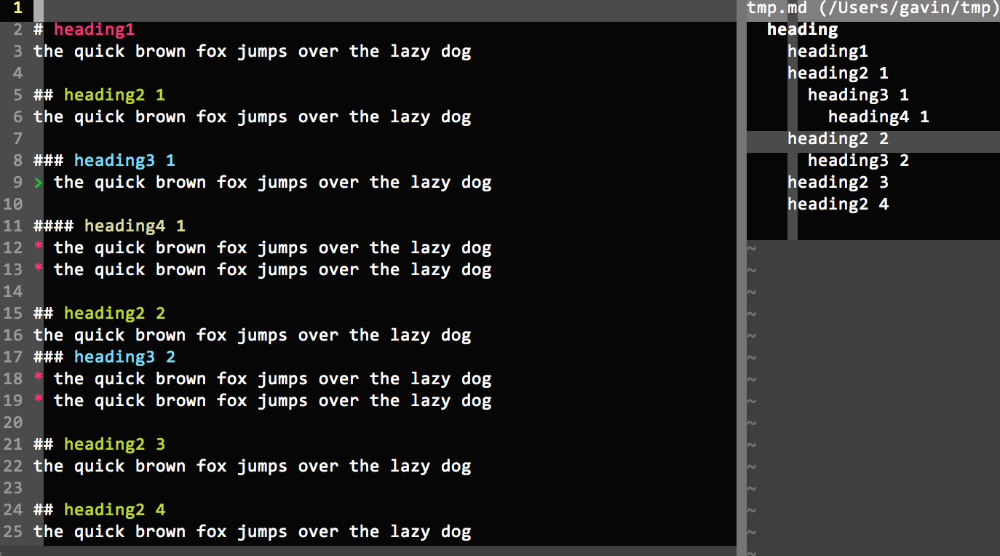

Exuberant Ctags (extended)
==============

## What's this?

This is a branch of Exuberant Ctags, the source code comes from:
<http://ctags.sourceforge.net>, see `README`(with no '.md' extension) for more
details.

This project, inherited from the original, follows the GNU General Public License

> It supports the following languages: Assembler, AWK, ASP, BETA,
> Bourne/Korn/Z Shell, C, C++, C#, COBOL, Eiffel, Erlang, Fortran, Java, Lisp,
> Lua, Makefile, Pascal, Perl, PHP, PL/SQL, Python, REXX, Ruby, Scheme,
> S-Lang, SML (Standard ML), Tcl, Vera, Verilog, VHDL, Vim, and YACC.

Besides above, this branch implemented a **_markdown_**
module, which extracts the headings of the markdown doc. Cooperated with vim and
taglist, a hierarchy of the document can be displayed as follows:

## What's done?

A file called `markdown.c` is added to the original project and some
modification of some files

## What are the features?

* extract the headings

	see the pic above

* extract the headings discarding the `<a>` html tag
	
		## some heading 1
		### some heading
		## some heading 2
		### some heading1

	the above will generate the taglist as follow:

		some heading 1
		  some heading
		some heading 2
		  some heading1

	this features is very useful for some markdown doc with many `jump tags`, the
	taglist wont display so many annoying html tags:

		some heading 1
		  some heading
		some heading 2
		  some heading1

## How to define a new language in Ctags?

in ctags, a new language is defined with a new `.c` file say `new_language.c`

besides `.c` file, there are files to modify:

1. source.mak

	source

		...
		yacc.c \
		new_language.c \
		vstring.c
		...

	object

		yacc.$(OBJEXT) \
		new_language.$(OBJEXT) \
		vstring.$(OBJEXT)

2. parser.h

	add new_language parser

		...
		VhdlParser, \
		VimParser, \
		YaccParser, \
		NewLanguageParser

2. taglist.vim

	taglist parses catags' output, taglist needs to be notified when there is a
	new language

		" vim language
		let s:tlist_def_vim_settings =
								\ 'vim;v:variable;a:autocmds;c:commands;m:map;f:function'

		" yacc language
		let s:tlist_def_yacc_settings = 'yacc;l:label'

		" markdown language
		let s:tlist_def_markdown_settings = 'markdown;h:heading'
